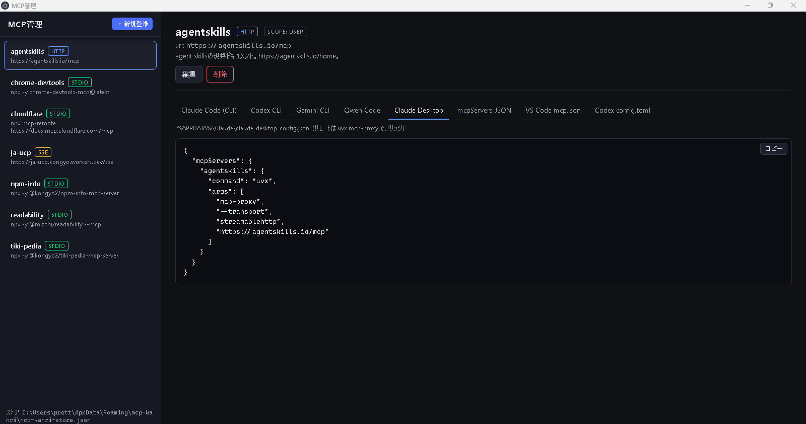
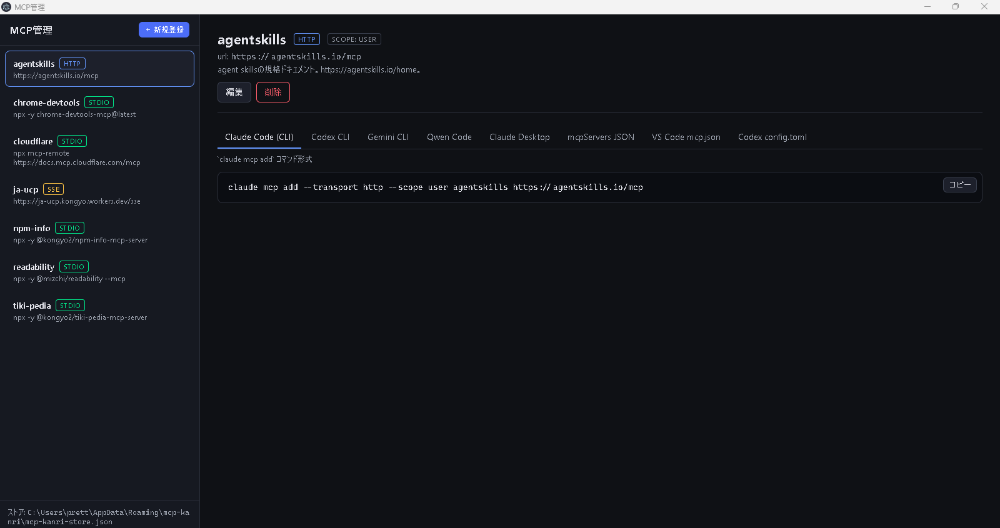

# mcp-kanri

Windows 11 向けの MCP (Model Context Protocol) 設定管理デスクトップアプリです。
1 つの MCP サーバ登録から Claude Code / Codex / Gemini / Qwen といった各 CLI
コマンドや、Claude Desktop / Cursor / VS Code 用の `mcpServers` JSON、Codex の
`config.toml` までワンクリックで生成・コピーできます。

## スクリーンショット

### Claude Desktop 用 `claude_desktop_config.json` をワンクリックで生成

リモート (HTTP / SSE) の MCP サーバは Claude Desktop 本体が直接対応していないため、
`uvx mcp-proxy` で stdio に橋渡しする形に自動変換します。



### Claude Code (CLI) の `claude mcp add` コマンドも同じ登録から生成

タブを切り替えるだけで、同じ MCP サーバ定義を別フォーマットへ瞬時に変換します。



## 主な機能

- **MCP サーバ登録の一元管理**: stdio / Streamable HTTP / SSE の 3 トランスポート
  に対応。`command` + `args` + `env`、または `url` + `headers` をフォームで編集
  できます。
- **8 種類の出力フォーマットを自動生成**: 1 つの登録から下記の貼り付け先を
  すべて出力します。
  - `Claude Code (CLI)` — `claude mcp add ...` コマンド
  - `Codex CLI` — `codex mcp add ...` コマンド
  - `Gemini CLI` — `gemini mcp add ...` コマンド
  - `Qwen Code` — `qwen mcp add ...` コマンド
  - `Claude Desktop` — `%APPDATA%\Claude\claude_desktop_config.json`
  - `mcpServers JSON` — Cursor / Windsurf / Cline などの共通形式
  - `VS Code mcp.json` — トップレベルキーが `servers` の VS Code 形式
  - `Codex config.toml` — `~/.codex/config.toml` 用の TOML 抜粋
- **クライアント差分の自動吸収**: クライアントごとの仕様差をアプリ側で
  解決します。例:
  - Claude Desktop は本体が stdio のみ対応のため、リモートサーバは
    `uvx mcp-proxy` で stdio に変換します。Streamable HTTP の場合は
    `--transport streamablehttp` を明示し、複数ヘッダは `--headers K V` を
    繰り返す形式で正しく出力します。
  - Codex CLI は SSE をネイティブ未対応のため、`npx -y mcp-remote` で
    stdio に橋渡しした形式で出力。
  - Gemini CLI / Qwen Code は `--` セパレータが必要なケースを正しく挿入。
  - `Authorization: Bearer ${ENV_VAR}` 形式のヘッダは Codex の
    `bearer_token_env_var` / `--bearer-token-env-var` に自動変換。
- **スコープ対応**: `local` / `project` / `user` を切り替えて出力。各 CLI の
  仕様に合わせて自動で正規化します (Gemini / Qwen は `local` を `project` に
  丸めるなど)。
- **安全なシェルクオート**: 値に空白や特殊文字を含む場合のみ `'...'` で
  くるみ、POSIX シェルにそのまま貼って動く形式で出力します。
- **ワンクリックコピー**: 生成結果はコピー ボタン 1 つで貼り付けられます。
- **永続化**: 登録は `%APPDATA%\mcp-kanri\mcp-kanri-store.json` に
  バージョニング付き JSON で保存されます。

## サーバ名の制約

すべての出力先クライアントで安全に使えるよう、サーバ名は `[A-Za-z0-9_-]+`
(64 文字以内) のみ許可しています。これは Codex CLI の `validate_server_name`
と TOML の bare key 制約 (`[mcp_servers.<name>]`) を満たす最大公約数です。

## 開発

```sh
npm install
npm run dev          # electron-vite dev (HMR)
npm run typecheck    # tsc --noEmit
npm run lint         # oxlint
npm run test         # vitest run
npm run build        # 本番ビルド
npm run build:win    # Windows インストーラ (NSIS) 生成
```

## 技術スタック

- Electron + electron-vite
- React 18 + TypeScript
- Zod (スキーマ検証)
- oxlint / Prettier / Vitest

## ライセンス

MIT
