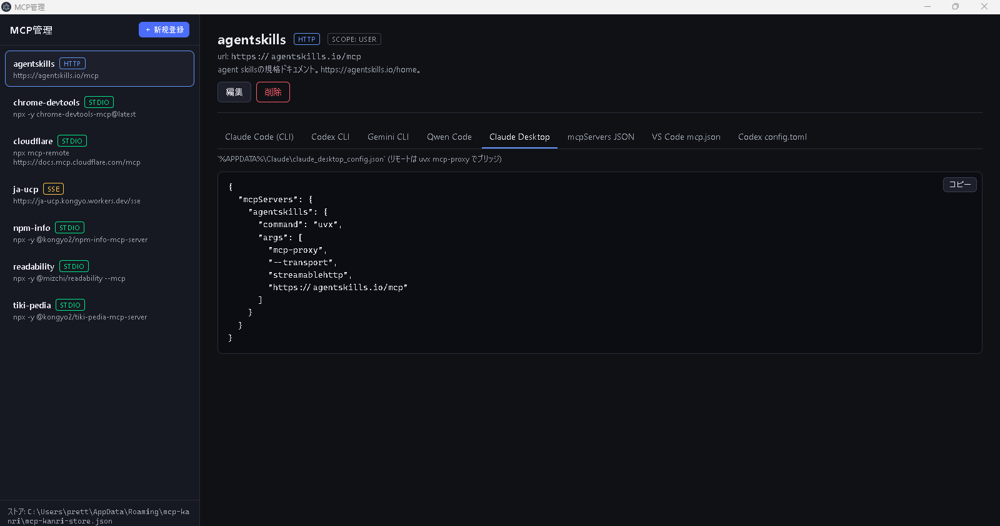
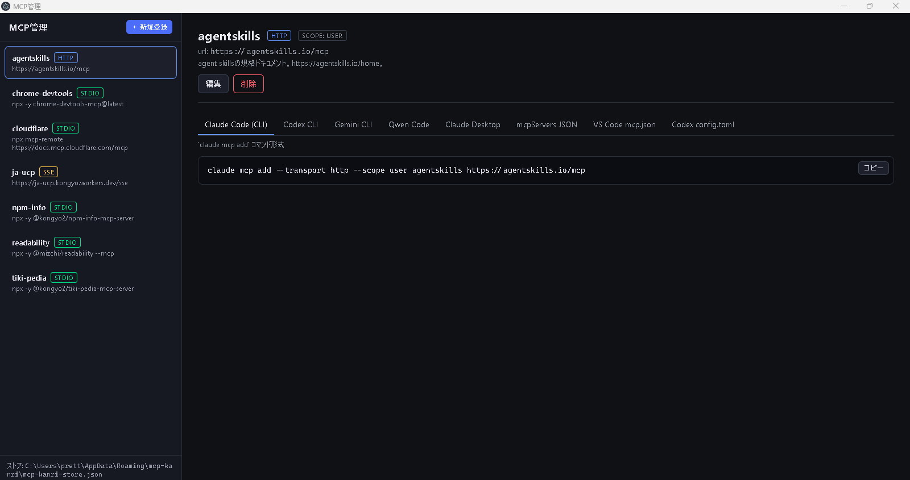

# mcp-kanri

> **Languages:** [日本語](#日本語) / [English](#english)

mcp-kanri is a Windows 11 desktop app for managing MCP (Model Context Protocol)
server configurations. From a single MCP registration, it generates and lets
you copy CLI commands for Claude Code / Codex / Gemini / Qwen / Grok Build, the
`mcpServers` JSON used by Claude Desktop / Cursor / VS Code / Google
Antigravity / Cline, and the `config.toml` snippets used by Codex and Grok
Build — all with one click.

The UI is fully bilingual (日本語 / English) and the language can be switched
at any time from the sidebar footer. The initial language is detected from the
operating system locale.

---

## 日本語

Windows 11 向けの MCP (Model Context Protocol) 設定管理デスクトップアプリです。
1 つの MCP サーバ登録から Claude Code / Codex / Gemini / Qwen / Grok Build と
いった各 CLI コマンドや、Claude Desktop / Cursor / VS Code / Google Antigravity /
Cline 用の `mcpServers` JSON、Codex と Grok Build の `config.toml` まで
ワンクリックで生成・コピーできます。

UI は日本語と英語に対応しており、サイドバー下部から切り替えられます。
初回起動時は OS のロケールから自動判定します。

### スクリーンショット

#### Claude Desktop 用 `claude_desktop_config.json` をワンクリックで生成

リモート (HTTP / SSE) の MCP サーバは Claude Desktop 本体が直接対応していないため、
`uvx mcp-proxy` で stdio に橋渡しする形に自動変換します。

#### Claude Code (CLI) の `claude mcp add` コマンドも同じ登録から生成

タブを切り替えるだけで、同じ MCP サーバ定義を別フォーマットへ瞬時に変換します。

### 主な機能

- **MCP サーバ登録の一元管理**: stdio / Streamable HTTP / SSE の 3 トランスポート
  に対応。`command` + `args` + `env`、または `url` + `headers` をフォームで編集
  できます。
- **12 種類の出力フォーマットを自動生成**: 1 つの登録から下記の貼り付け先を
  すべて出力します。
  - `Claude Code (CLI)` — `claude mcp add ...` コマンド
  - `Codex CLI` — `codex mcp add ...` コマンド
  - `Gemini CLI` — `gemini mcp add ...` コマンド
  - `Qwen Code` — `qwen mcp add ...` コマンド
  - `Grok Build (CLI)` — `grok mcp add ...` コマンド
  - `Claude Desktop` — `%APPDATA%\Claude\claude_desktop_config.json`
  - `mcpServers JSON` — Cursor / Windsurf などの共通形式
  - `VS Code mcp.json` — トップレベルキーが `servers` の VS Code 形式
  - `Codex config.toml` — `~/.codex/config.toml` 用の TOML 抜粋
  - `Grok config.toml` — `%USERPROFILE%\.grok\config.toml` (user) /
    `.grok\config.toml` (project) 用の `[mcp_servers.<name>]` 抜粋
  - `Antigravity mcp_config.json` — Google Antigravity Editor 用
    `~/.gemini/antigravity/mcp_config.json` (リモートは `url` ではなく
    `serverUrl` キー)
  - `Cline (cline_mcp_settings.json)` — VS Code 拡張
    `saoudrizwan.claude-dev` の `cline_mcp_settings.json` 用 JSON
    (Streamable HTTP の `type` は `"streamableHttp"` で `"http"` ではない)
- **クライアント差分の自動吸収**: クライアントごとの仕様差をアプリ側で
  解決します。例:
  - Claude Desktop は本体が stdio のみ対応のため、リモートサーバは
    `uvx mcp-proxy` で stdio に変換します。Streamable HTTP の場合は
    `--transport streamablehttp` を明示し、複数ヘッダは `--headers K V` を
    繰り返す形式で正しく出力します。
  - Codex CLI は SSE をネイティブ未対応のため、`npx -y mcp-remote` で
    stdio に橋渡しした形式で出力。
  - Gemini CLI / Qwen Code は `--` セパレータが必要なケースを正しく挿入。
  - `Authorization: Bearer ${ENV_VAR}` 形式のヘッダは Codex の
    `bearer_token_env_var` / `--bearer-token-env-var` に自動変換。
  - Google Antigravity はリモート URL のキー名が `serverUrl` (camelCase)
    で他のクライアントと異なるため、自動で書き換えます。SSE はネイティブ
    未対応なので `npx -y mcp-remote` で stdio に橋渡しします
    (https://antigravity.google/docs/mcp)。
  - Cline は Streamable HTTP の `type` リテラルが `"streamableHttp"`
    (camelCase) で、Cursor / VS Code / Claude の `"http"` とは異なるため、
    自動で書き換えます (cline `src/services/mcp/schemas.ts` 参照)。
    保存先は VS Code globalStorage の
    `saoudrizwan.claude-dev/settings/cline_mcp_settings.json` です。
  - Grok Build は HTTP / SSE をネイティブ対応 (`url` と `type = "sse"`) して
    いるため、`uvx mcp-proxy` / `npx mcp-remote` でのブリッジは行わず、
    そのまま `url` 形式で出力します (公式ドキュメントもネイティブ形式を
    推奨)。OAuth が必要なサーバは Grok Build がブラウザ認証まで行い、
    トークンを `~/.grok/mcp_credentials.json` に保存するため、
    `Authorization` ヘッダを手書きする必要はありません。
  - Grok Build の scope は `user` と `project` の 2 つだけなので、`local` は
    `project` (`.grok\config.toml`) に丸め、その旨をコメントで注記します。
  - Grok Build は `server__tool` (アンダースコア 2 つ) でツールを
    カタログ登録するため、サーバ名が英字か `_` 以外で始まる場合
    (`InvalidServerName`)、末尾が `_` の場合や `__` を含む場合
    (`InvalidOrAmbiguousQualifiedName`) はツールが読み込まれません。
    `grok mcp add` 自体は成功してしまうため、該当する登録には出力に
    コメントで注記します。
  - Grok Build は URL が `/sse` で終わるリモートサーバを、`type` の指定に
    関わらず SSE として接続します。`--transport http` で登録していても
    同じなので、該当する場合は注記します。
  - ヘッダや env に書いた `${VAR}` / `${VAR:-default}` は Grok Build が
    読み込み時に展開するため、Codex のような `env_http_headers` /
    `bearer_token_env_var` への振り分けはせず、そのまま出力します。
  - stdio の引数は `--` の後ろに、env は `-e KEY=value` を 1 つずつ繰り返す
    形式で出力します (Grok Build の `--env` は 1 フラグにつき 1 ペア)。
  - Windows では `npx` などの `.cmd` シムを Grok Build が `PATH` / `PATHEXT`
    から解決するため、`cmd /c` でくるむ必要はありません。
  - Grok Build は `~/.claude.json` / `.cursor/mcp.json` / `.mcp.json` も
    読み込むので、「mcpServers JSON」タブの出力もそのまま使えます。
  - `npx` / `uvx` のように初回起動でパッケージを取得する stdio サーバは、
    既定 30 秒の `startup_timeout_sec` に収まらないことがあります。その場合は
    貼り付けた `[mcp_servers.<name>]` に `startup_timeout_sec` を足し、
    `grok mcp doctor <name>` で接続を確認してください。
- **スコープ対応**: `local` / `project` / `user` を切り替えて出力。各 CLI の
  仕様に合わせて自動で正規化します (Gemini / Qwen / Grok Build は `local` を
  `project` に丸めるなど)。
- **安全なシェルクオート**: 値に空白や特殊文字を含む場合のみ `'...'` で
  くるみ、POSIX シェルにそのまま貼って動く形式で出力します。
- **ワンクリックコピー**: 生成結果はコピー ボタン 1 つで貼り付けられます。
- **永続化**: 登録は `%APPDATA%\mcp-kanri\mcp-kanri-store.json` に
  バージョニング付き JSON で保存されます。
- **多言語対応 (日本語 / English)**: サイドバー下部のスイッチで言語を切り替え
  られます。選択は `localStorage` に保存され、main プロセス側のエラーメッセージ
  も同じ言語で返ります。

---

## English

mcp-kanri is a Windows 11 desktop app for managing MCP (Model Context Protocol)
configurations. From a single MCP server registration, it generates and copies
the CLI commands for Claude Code / Codex / Gemini / Qwen / Grok Build, the
`mcpServers` JSON for Claude Desktop / Cursor / VS Code / Google Antigravity /
Cline, and the `config.toml` snippets for Codex and Grok Build, all with a
single click.

### Screenshots

#### Generate `claude_desktop_config.json` for Claude Desktop with one click

Claude Desktop itself does not support remote (HTTP / SSE) MCP servers
directly, so remote servers are automatically rewritten to a stdio command
that bridges through `uvx mcp-proxy`.

#### Generate the `claude mcp add` command for Claude Code (CLI) from the same registration

Switching tabs is enough to convert the same MCP server definition into
another format on the fly.

### Highlights

- **Centralised MCP server registry**: supports the three transports
  (`stdio` / Streamable HTTP / SSE). Edit `command` + `args` + `env`, or
  `url` + `headers`, from a form.
- **Twelve output formats generated automatically**: a single registration is
  rendered into all of the following:
  - `Claude Code (CLI)` — `claude mcp add ...` command
  - `Codex CLI` — `codex mcp add ...` command
  - `Gemini CLI` — `gemini mcp add ...` command
  - `Qwen Code` — `qwen mcp add ...` command
  - `Grok Build (CLI)` — `grok mcp add ...` command
  - `Claude Desktop` — `%APPDATA%\Claude\claude_desktop_config.json`
  - `mcpServers JSON` — common form for Cursor / Windsurf, etc.
  - `VS Code mcp.json` — VS Code form whose top-level key is `servers`
  - `Codex config.toml` — TOML excerpt for `~/.codex/config.toml`
  - `Grok config.toml` — `[mcp_servers.<name>]` excerpt for
    `%USERPROFILE%\.grok\config.toml` (user) or `.grok\config.toml` (project)
  - `Antigravity mcp_config.json` — Google Antigravity Editor's
    `~/.gemini/antigravity/mcp_config.json` (remote uses the `serverUrl`
    key, not `url`)
  - `Cline (cline_mcp_settings.json)` — JSON for the VS Code extension
    `saoudrizwan.claude-dev`. Its Streamable HTTP `type` literal is
    `"streamableHttp"`, not `"http"`.
- **Per-client quirks handled for you**:
  - Because Claude Desktop only speaks stdio natively, remote servers are
    rewritten via `uvx mcp-proxy`. For Streamable HTTP sources we emit
    `--transport streamablehttp` explicitly and repeat `--headers K V`
    once per header.
  - Because Codex CLI does not support SSE natively, SSE servers are bridged
    to stdio via `npx -y mcp-remote`.
  - For Gemini CLI / Qwen Code, the `--` separator is inserted whenever
    the server-side args could collide with known flags.
  - `Authorization: Bearer ${ENV_VAR}` headers are converted to Codex's
    `bearer_token_env_var` / `--bearer-token-env-var` automatically.
  - Google Antigravity uses `serverUrl` (camelCase) for remote URLs, which
    differs from every other client; the converter rewrites the key
    automatically. SSE is not supported natively, so SSE entries are
    bridged to stdio via `npx -y mcp-remote`
    (https://antigravity.google/docs/mcp).
  - Cline's Streamable HTTP `type` literal is `"streamableHttp"`
    (camelCase), not `"http"` like Cursor / VS Code / Claude. The
    converter rewrites it automatically (see cline
    `src/services/mcp/schemas.ts`). The settings file lives in the VS
    Code globalStorage at
    `saoudrizwan.claude-dev/settings/cline_mcp_settings.json`.
  - Grok Build speaks HTTP and SSE natively (`url` plus `type = "sse"`), so
    remote servers are emitted in that native form instead of being bridged
    through `uvx mcp-proxy` / `npx mcp-remote` — which is what the Grok Build
    documentation recommends. OAuth servers are handled by Grok Build itself
    (browser flow, tokens stored in `~/.grok/mcp_credentials.json`), so there
    is no `Authorization` header to write by hand.
  - Grok Build only has the `user` and `project` scopes, so `local` is
    rounded to `project` (`.grok\config.toml`) with a note in the output.
  - Grok Build registers tools under `server__tool` (two underscores), so a
    server name that starts with anything other than a letter or `_`
    (`InvalidServerName`), ends with `_`, or contains `__`
    (`InvalidOrAmbiguousQualifiedName`) never gets its tools loaded. Since
    `grok mcp add` itself still succeeds, the output carries a note whenever
    the name hits one of those rules.
  - Grok Build connects to any remote server whose URL ends with `/sse` over
    SSE regardless of `type`, even when it was added with
    `--transport http`, so that case is flagged too.
  - `${VAR}` / `${VAR:-default}` references in headers and env values are
    expanded by Grok Build at load time, so they are emitted verbatim rather
    than being split into Codex-style `env_http_headers` /
    `bearer_token_env_var`.
  - stdio arguments are placed after `--`, and env values are emitted as one
    repeated `-e KEY=value` flag per entry (Grok Build's `--env` takes a
    single pair per flag).
  - On Windows there is no need to wrap `npx` and friends in `cmd /c`: Grok
    Build resolves the `.cmd` shim through `PATH` / `PATHEXT` itself.
  - Grok Build also reads `~/.claude.json`, `.cursor/mcp.json` and
    `.mcp.json`, so the "mcpServers JSON" tab works for it as well.
  - stdio servers that fetch their package on first launch (`npx`, `uvx`) can
    outlast the 30 second default `startup_timeout_sec`. Add that key to the
    pasted `[mcp_servers.<name>]` block when it happens, then verify with
    `grok mcp doctor <name>`.
- **Scope aware**: emits `local` / `project` / `user`, normalised to each
  CLI's accepted values (e.g. Gemini / Qwen / Grok Build collapse `local` to
  `project`).
- **Safe shell quoting**: values are single-quoted only when they contain
  whitespace or special characters, so the output can be pasted into any
  POSIX shell as-is.
- **One-click copy**: every generated block has a copy button.
- **Persistent storage**: registrations live in
  `%APPDATA%\mcp-kanri\mcp-kanri-store.json` as versioned JSON.
- **Bilingual UI (日本語 / English)**: switch languages from the sidebar
  footer. The choice is persisted in `localStorage` and the main process
  honours it for error messages too.

## License

MIT
